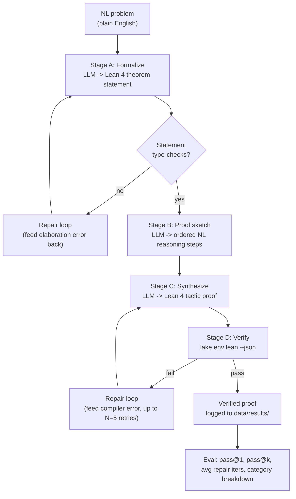
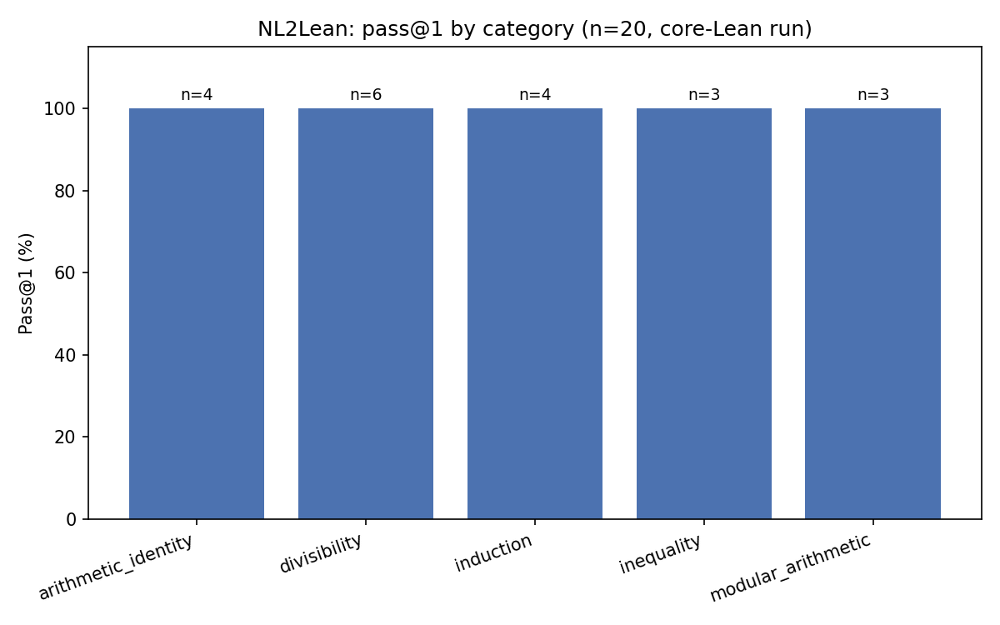
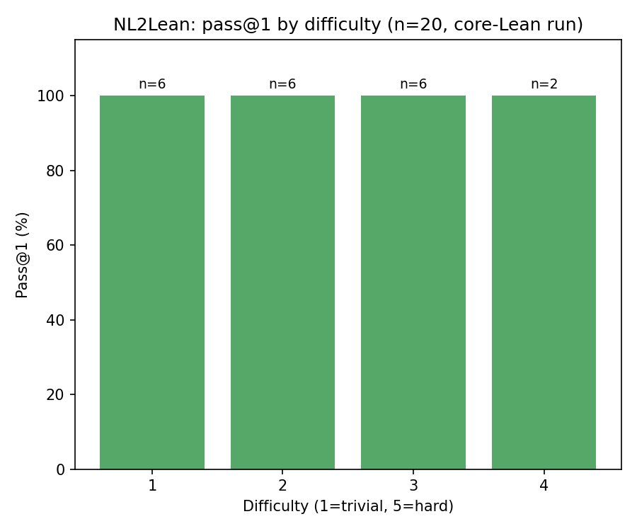
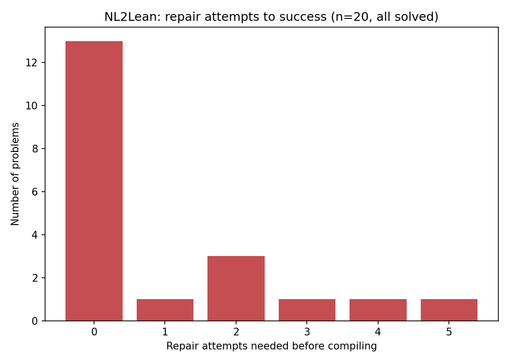
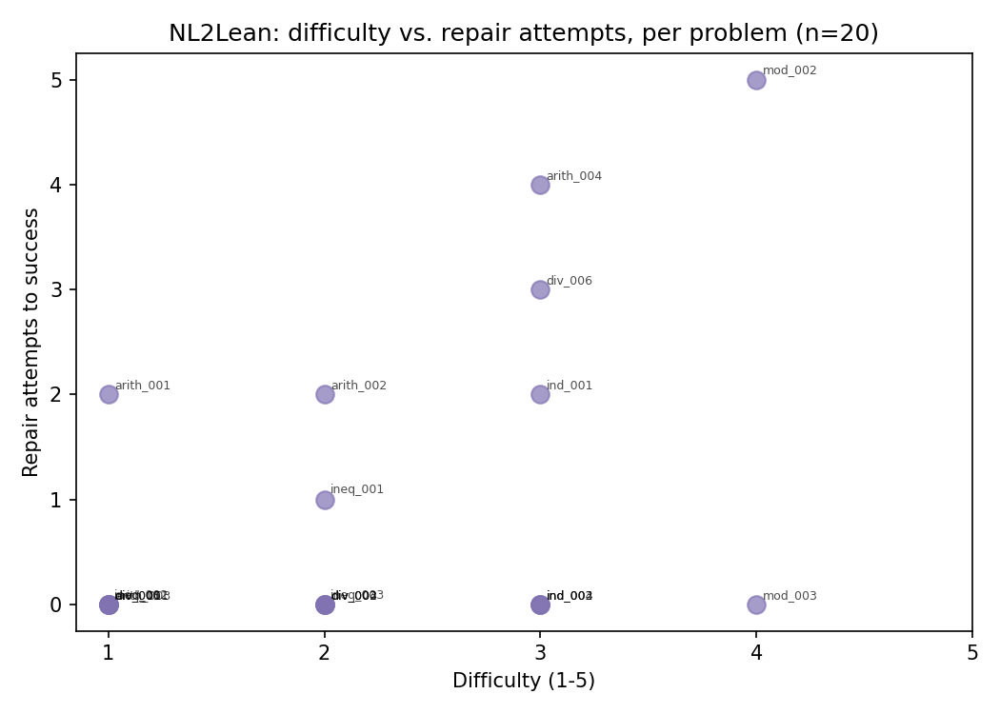

# NL2Lean

**Natural language math problem → decomposed reasoning steps → verified Lean 4 proof.**

> **Status: a real run has been executed and verified — see [`RUN_REPORT.md`](RUN_REPORT.md).**
> 20/20 problems solved with genuine repair loops (some took 4-6 real
> attempts before landing), all proofs independently re-verified by the
> actual Lean 4.14.0 compiler. Read the run report first — it's short and
> explains an important environment constraint (no Mathlib cache access in
> the build sandbox) that shaped this run, why 100% pass@1 here is *not* a
> claim about general capability, and what changes once you run it on your
> own machine. (`lean_project/lean-toolchain` has since been updated past
> 4.14.0 — see the run report's addendum for what that did and didn't
> affect.)
>
> Real charts generated from this run's actual data live in
> [`docs/figures/`](docs/figures/) — pass@1 by category, pass@1 by
> difficulty, repair-attempts histogram, and difficulty-vs-repairs scatter.

This repo is a research prototype that turns a plain-English math statement into a
Lean 4 theorem + tactic proof that actually compiles against Mathlib. It does not
just "generate Lean-looking text" — every proof in `data/results/` has been run
through `lake env lean` and passed. Unverified attempts are logged separately and
never counted toward accuracy numbers.

## Why this split works for a two-person team

| Owns | Responsibility |
|---|---|
| You | LLM pipeline (formalization, sketch, synthesis, self-repair), infra, eval harness, dataset, plots |
| Senior / formal-methods partner | Lean 4 / Mathlib correctness review, tactic library curation, adjudicating "is this proof actually meaningful or did the model cheat with `sorry`/`decide`-abuse" |

## Pipeline



## Repo layout

```
nl2lean/
├── README.md
├── lean_project/           # actual Lean 4 + Mathlib project (lakefile, toolchain)
├── prompts/                # the 4 prompt templates used by the pipeline (see below)
├── src/                    # Python pipeline
│   ├── llm_client.py       # Groq API wrapper (shared by all stages)
│   ├── formalize.py        # Stage A
│   ├── proof_sketch.py     # Stage B
│   ├── synthesize.py       # Stage C
│   ├── verify.py           # Stage D — subprocess wrapper around lake/lean
│   └── pipeline.py         # end-to-end runner, CLI entrypoint
├── data/
│   ├── schema.md
│   ├── seed_problems.json  # 20 problems (arithmetic identities / divisibility / induction / inequality / modular arithmetic)
│   └── results/             # verified proofs get written here as JSONL
├── eval/
│   └── metrics.py
└── docs/
    ├── architecture.md
    ├── roadmap.md
    ├── dataset_card.md
    └── model_card.md
```

## Quickstart

```bash
# 1. Lean toolchain (elan manages versions per lean-toolchain file)
curl https://raw.githubusercontent.com/leanprover/elan/master/elan-init.sh -sSf | sh
cd lean_project && lake exe cache get   # pulls prebuilt Mathlib oleans, saves hours

# 2. Python side
python -m venv .venv && source .venv/bin/activate
pip install -r requirements.txt
export GROQ_API_KEY=gsk_...
# optional: export GROQ_MODEL=llama-3.3-70b-versatile   (this is the default)

# 3. Run the pipeline on the seed set
python src/pipeline.py --input data/seed_problems.json --out data/results/run1.jsonl --max-repair 5
python eval/metrics.py data/results/run1.jsonl
```

## Results

Real charts generated from `data/results/run1_core_lean.jsonl` (see `RUN_REPORT.md` for the full honest caveats on what this run does and doesn't prove):

### Pass@1 by category


### Pass@1 by difficulty


### Repair attempts to success


### Difficulty vs. repair attempts


## Milestone plan

See `docs/roadmap.md`. Short version: 10 problems working end-to-end this week →
50 by end of week 2 → publish a v0 dataset card + repo → 500 with category
breakdown and pass@k curves → write it up.
